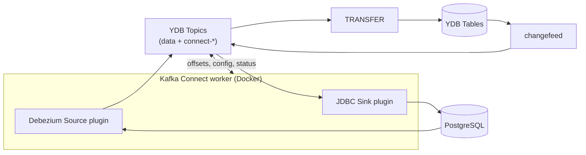
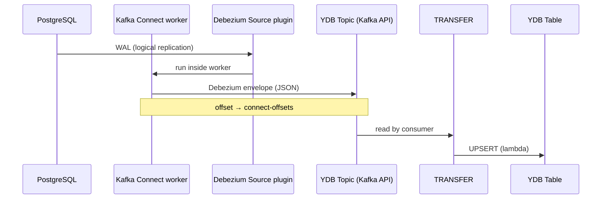
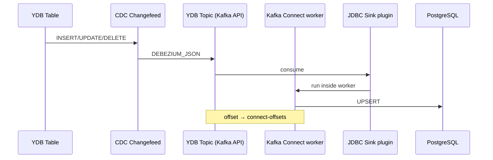

# Инкрементальная синхронизация PostgreSQL и {{ ydb-short-name }} через CDC

## Обзор

{{ ydb-short-name }} не предоставляет единого «коробочного» коннектора для двунаправленной репликации с PostgreSQL. Для **near real-time** инкрементальной синхронизации используется связка стандартных инструментов CDC и встроенных возможностей {{ ydb-short-name }}.

**Среда выполнения коннекторов** — [Kafka Connect](https://kafka.apache.org/documentation/#connect): stateless Java-приложение (worker), которое поднимается в Docker и исполняет плагины-коннекторы. И **Debezium PostgreSQL Connector**, и **JDBC Sink Connector** — это плагины поверх одного и того же worker'а, а не отдельные сервисы.

**Хранилище данных и служебного состояния** — {{ ydb-short-name }} через [Kafka API](../../reference/kafka-api/index.md): топики changefeed/Debezium для потока изменений и служебные топики Connect (`connect-offsets`, `connect-configs`, `connect-status`) для offset'ов и конфигурации. Отдельный брокер Kafka для POC и production-пайплайна не обязателен.

| Направление | Цепочка | Роль {{ ydb-short-name }} |
| --- | --- | --- |
| **PostgreSQL → {{ ydb-short-name }}** | Kafka Connect (Debezium Source) → [топик](../../concepts/datamodel/topic.md) → [TRANSFER](../../concepts/transfer.md) | Топики данных + state Connect |
| **{{ ydb-short-name }} → PostgreSQL** | [CDC changefeed](../../concepts/cdc.md) → топик → Kafka Connect (JDBC Sink) | Топики данных + state Connect |

Для **начальной (полной) загрузки** из PostgreSQL используйте [YDB Importer](import-jdbc.md). Для ad-hoc чтения без репликации — [федеративные запросы](../../concepts/query_execution/federated_query/postgresql.md) (только `SELECT`, не для регулярного ETL).

Документ описывает архитектуру обоих направлений на примере доменных объектов **заказы пользователя** (`user_orders`) и **платежи пользователя** (`user_payments`) и может быть воспроизведён локально в Docker.

---

## Доменная модель (пример)

### PostgreSQL (schema `shop`)

```sql
CREATE SCHEMA shop;

CREATE TABLE shop.user_orders (
    order_id    BIGSERIAL PRIMARY KEY,
    user_id     BIGINT NOT NULL,
    product_name TEXT NOT NULL,
    amount      NUMERIC(12, 2) NOT NULL,
    status      TEXT NOT NULL DEFAULT 'new',
    created_at  TIMESTAMPTZ NOT NULL DEFAULT now(),
    updated_at  TIMESTAMPTZ NOT NULL DEFAULT now()
);

CREATE TABLE shop.user_payments (
    payment_id  BIGSERIAL PRIMARY KEY,
    order_id    BIGINT NOT NULL REFERENCES shop.user_orders(order_id),
    user_id     BIGINT NOT NULL,
    amount      NUMERIC(12, 2) NOT NULL,
    status      TEXT NOT NULL DEFAULT 'pending',
    created_at  TIMESTAMPTZ NOT NULL DEFAULT now(),
    updated_at  TIMESTAMPTZ NOT NULL DEFAULT now()
);

ALTER TABLE shop.user_orders REPLICA IDENTITY FULL;
ALTER TABLE shop.user_payments REPLICA IDENTITY FULL;
```

### {{ ydb-short-name }}

```yql
CREATE TABLE user_orders (
    order_id Int64 NOT NULL,
    user_id Int64,
    product_name Utf8,
    amount Decimal(12, 2),
    status Utf8,
    created_at Timestamp,
    updated_at Timestamp,
    PRIMARY KEY (order_id)
);

CREATE TABLE user_payments (
    payment_id Int64 NOT NULL,
    order_id Int64,
    user_id Int64,
    amount Decimal(12, 2),
    status Utf8,
    created_at Timestamp,
    updated_at Timestamp,
    PRIMARY KEY (payment_id)
);
```

Неключевые колонки в {{ ydb-short-name }} допускают `NULL` — это упрощает обработку partial update из Debezium.

---

## Kafka Connect как платформа {#kafka-connect-platform}

[Kafka Connect](https://kafka.apache.org/documentation/#connect) — распределённая **stateless**-обёртка над коннекторами. Worker не хранит offset'ы и конфигурацию локально (кроме in-memory кеша): при рестарте контейнера состояние поднимается из топиков.



**Типы топиков в {{ ydb-short-name }}:**

| Топик | Назначение |
| --- | --- |
| `dbz.shop.user_orders`, … | Поток изменений (данные) |
| `connect-offsets` | Offset'ы source/sink коннекторов |
| `connect-configs` | Конфигурация коннекторов |
| `connect-status` | Статус задач worker'а |

Служебные топики создайте до первого запуска worker'а. Минимальная конфигурация worker'а ([подробнее](../../reference/kafka-api/connect/connect-step-by-step.md)):

```ini
bootstrap.servers=ydb:9092
consumer.check.crcs=false

# Хранение state Connect в YDB Topics
config.storage.topic=connect-configs
offset.storage.topic=connect-offsets
status.storage.topic=connect-status
config.storage.replication.factor=1
offset.storage.replication.factor=1
status.storage.replication.factor=1

key.converter=org.apache.kafka.connect.storage.StringConverter
value.converter=org.apache.kafka.connect.storage.StringConverter
```

Один worker может одновременно исполнять Debezium Source (PG→топик) и JDBC Sink (топик→PG) — для изоляции направлений на практике чаще поднимают два worker'а с разными `GROUP_ID`, но оба могут использовать один {{ ydb-short-name }} как `bootstrap.servers`.

---

## PostgreSQL → {{ ydb-short-name }}

### Архитектура



**Компоненты:**

1. **PostgreSQL** — источник транзакций; logical decoding через `pgoutput`.
2. **[Kafka Connect worker](https://kafka.apache.org/documentation/#connect)** — stateless Java-процесс в Docker; исполняет плагины.
3. **[Debezium PostgreSQL Connector](https://debezium.io/documentation/reference/stable/connectors/postgresql.html)** — source-плагин Connect; читает WAL, публикует изменения в топики. Offset'ы хранятся в `connect-offsets` в {{ ydb-short-name }}.
4. **[Kafka API](../../reference/kafka-api/index.md)** — {{ ydb-short-name }} принимает запись в [топики](../../concepts/datamodel/topic.md) по протоколу, совместимому с Apache Kafka.
5. **[TRANSFER](../../concepts/transfer.md)** — асинхронно читает топик, преобразует сообщения lambda-функцией и выполняет UPSERT в целевую таблицу.

Альтернатива TRANSFER — [ydb-kafka-sink-connector](https://github.com/ydb-platform/ydb-kafka-sink-connector); TRANSFER предпочтительнее, если преобразование выполняется в YQL на стороне {{ ydb-short-name }}.

### Требования к PostgreSQL

| Параметр | Значение |
| --- | --- |
| `wal_level` | `logical` |
| `max_replication_slots` | ≥ 4 |
| `max_wal_senders` | ≥ 4 |
| `REPLICA IDENTITY` | `FULL` на реплицируемых таблицах |
| Publication | На `shop.user_orders`, `shop.user_payments` |
| Пользователь Debezium | `REPLICATION` + `SELECT` на таблицы |

Пример publication:

```sql
CREATE PUBLICATION dbz_publication FOR TABLE shop.user_orders, shop.user_payments;
```

### Настройка Debezium

Ключевые параметры коннектора:

```json
{
  "name": "postgresql-orders-payments",
  "config": {
    "connector.class": "io.debezium.connector.postgresql.PostgresConnector",
    "database.hostname": "postgres",
    "database.port": "5432",
    "database.user": "debezium",
    "database.dbname": "shopdb",
    "topic.prefix": "dbz",
    "schema.include.list": "shop",
    "table.include.list": "shop.user_orders,shop.user_payments",
    "plugin.name": "pgoutput",
    "publication.name": "dbz_publication",
    "slot.name": "debezium_slot",
    "snapshot.mode": "initial"
  }
}
```

Bootstrap-сервер для записи в {{ ydb-short-name }}: `ydb:9092` (имя сервиса в Docker-сети) или `localhost:9092` при локальном запуске. Топики нужно **создать заранее** в {{ ydb-short-name }} с именами, совпадающими с Debezium (например, `dbz.shop.user_orders`).

### TRANSFER и формат Debezium

Debezium пишет envelope с полями `payload.op` (`c`/`u`/`r`/`d`), `payload.before`, `payload.after`. {{ ydb-short-name }} natively поддерживает совместимый формат `DEBEZIUM_JSON` в [changefeed](../../concepts/cdc.md#debezium-json-record-structure); для TRANSFER из внешнего Debezium lambda разбирает тот же envelope.

Пример lambda для `user_orders` (soft-delete при `op = "d"`):

```yql
$transformation_lambda = ($msg) -> {
    $cdc_data = CAST($msg._data AS Json);
    $operation = Json::ConvertToString($cdc_data.payload.op);
    $is_deleted = $operation == "d";
    $data = IF($is_deleted, $cdc_data.payload.before, $cdc_data.payload.after);

    return IF(
        $data IS NOT NULL,
        [
            <|
                order_id: CAST(Json::ConvertToString($data.order_id) AS Int64),
                user_id: CAST(Json::ConvertToString($data.user_id) AS Int64),
                product_name: CAST(Json::ConvertToString($data.product_name) AS Utf8),
                amount: CAST(Json::ConvertToString($data.amount) AS Decimal(12, 2)),
                status: IF($is_deleted, Just("deleted"), CAST(Json::ConvertToString($data.status) AS Utf8)),
                updated_at: CurrentUtcTimestamp()
            |>
        ],
        []
    );
};

CREATE TRANSFER orders_transfer
    FROM `dbz.shop.user_orders` TO user_orders
    USING $transformation_lambda;
```

Аналогичный TRANSFER создаётся для `user_payments`.



[TRANSFER](../../concepts/transfer.md) выполняет только UPSERT. Физическое удаление строк в {{ ydb-short-name }} через TRANSFER не поддерживается — используйте soft-delete (флаг `is_deleted` / статус `deleted`) или периодическую очистку через `DELETE`. Подробнее — в [рецепте SCD1](../../analyst/practical-guides/scd/scd1-transfer.md).



### Начальная загрузка

Два варианта:

1. **`snapshot.mode=initial`** в Debezium — snapshot существующих строк PG попадает в топик до streaming.
2. Разовый [YDB Importer](import-jdbc.md), затем Debezium с `snapshot.mode=never` для только инкрементальных изменений.

---

## {{ ydb-short-name }} → PostgreSQL

### Архитектура



**Компоненты:**

1. **Строковая таблица {{ ydb-short-name }}** — источник OLTP-изменений.
2. **[CDC changefeed](../../concepts/cdc.md)** — формирует поток изменений в топик; гарантии exactly-once в пределах ключа.
3. **[Kafka Connect worker](https://kafka.apache.org/documentation/#connect)** — stateless Java-процесс в Docker.
4. **JDBC Sink Connector** — sink-плагин Connect; читает changefeed-топик через Kafka API, записывает в PostgreSQL ([пример конфигурации](../../reference/kafka-api/connect/connect-examples.md)).

### Changefeed на источнике

```yql
ALTER TABLE user_orders ADD CHANGEFEED orders_cf WITH (
    FORMAT = 'DEBEZIUM_JSON',
    MODE = 'NEW_AND_OLD_IMAGES',
    INITIAL_SCAN = TRUE
);

ALTER TABLE user_payments ADD CHANGEFEED payments_cf WITH (
    FORMAT = 'DEBEZIUM_JSON',
    MODE = 'NEW_AND_OLD_IMAGES',
    INITIAL_SCAN = TRUE
);
```

`INITIAL_SCAN = TRUE` выгружает существующие строки в топик при создании changefeed — аналог начального snapshot для PG.

Имя топика changefeed получите через:

```bash
ydb scheme describe user_orders
```

### Kafka Connect worker (JDBC Sink)

Worker использует ту же конфигурацию, что в разделе [Kafka Connect как платформа](#kafka-connect-platform): `bootstrap.servers=ydb:9092`, служебные топики `connect-*` в {{ ydb-short-name }}.

Перед запуском sink создайте [читателя топика](../../reference/ydb-cli/topic-consumer-add.md) changefeed с именем, совпадающим с `group.id` коннектора (см. [пошаговую инструкцию](../../reference/kafka-api/connect/connect-step-by-step.md)).

### JDBC Sink в PostgreSQL

Базовый конфиг (один коннектор на таблицу):

```ini
connector.class=io.confluent.connect.jdbc.JdbcSinkConnector
connection.url=jdbc:postgresql://postgres:5432/shopdb
connection.user=shop
connection.password=shop

topics=<changefeed-topic-for-orders>
insert.mode=upsert
pk.mode=record_key
auto.create=false
auto.evolve=false

transforms=unwrap
transforms.unwrap.type=io.debezium.transforms.ExtractNewRecordState
transforms.unwrap.drop.tombstones=false
transforms.unwrap.delete.handling.mode=rewrite
```

Целевые таблицы `shop.user_orders` и `shop.user_payments` создаются в PostgreSQL заранее. Foreign key между payments и orders для CDC-пайплайна лучше не включать — события могут приходить out-of-order.

---

## Локальная проверка в Docker

Минимальный стек для POC на одной машине:

| Сервис | Образ | Порты |
| --- | --- | --- |
| {{ ydb-short-name }} | `ydbplatform/local-ydb:latest` | 2136 (gRPC), 8765 (UI), 9092 (Kafka API) |
| PostgreSQL | `postgres:16` | 5432 |
| Kafka Connect | `debezium/connect:2.7` (+ JDBC plugin при YDB→PG) | 8083 (REST) |

Образ `debezium/connect` уже содержит Kafka Connect worker и Debezium Source. Для направления YDB→PG установите [JDBC Sink plugin](https://www.confluent.io/hub/confluentinc/kafka-connect-jdbc) в тот же worker — отдельный брокер Kafka не нужен: и данные, и state Connect (`connect-offsets`, `connect-configs`, `connect-status`) хранятся в топиках {{ ydb-short-name }}.

Запуск {{ ydb-short-name }} в Docker — см. [инструкцию](../../reference/docker/start.md). Kafka API доступен на порту **9092** без SASL при анонимной аутентификации.



Для одновременной проверки **обоих** направлений используйте **два изолированных compose-стека** (разные порты PG и {{ ydb-short-name }}), чтобы не смешивать Debezium-топики и changefeed-топики.



### Сценарий проверки

1. Поднять стек, применить DDL в PG и {{ ydb-short-name }}.
2. Убедиться, что seed-данные реплицировались (initial snapshot / INITIAL_SCAN).
3. Выполнить `INSERT` и `UPDATE` в источнике.
4. Через ≤ 30 секунд проверить строки в приёмнике по PK.
5. Проверить `DELETE` (soft-delete в PG→YDB через TRANSFER; tombstone/rewrite в YDB→PG через JDBC Sink).

---

## Сравнение с другими подходами

| Задача | Инструмент | Тип синхронизации |
| --- | --- | --- |
| Разовая миграция PG → {{ ydb-short-name }} | [YDB Importer](import-jdbc.md) | Bulk, не инкремент |
| Ad-hoc чтение из PG | [Federated Query](../../concepts/query_execution/federated_query/postgresql.md) | Запрос по требованию, не CDC |
| Репликация {{ ydb-short-name }} → {{ ydb-short-name }} | [Async Replication](../../concepts/async-replication.md) | Встроенная, не PostgreSQL |
| Polling PG → {{ ydb-short-name }} | JDBC Source (`mode=timestamp`) → топик → TRANSFER | Минуты задержки, без WAL |

---

## Ограничения и риски

| Риск | Рекомендация |
| --- | --- |
| TRANSFER не удаляет строки | Soft-delete или периодический `DELETE` |
| Несовместимость отдельных API Kafka Connect с YDB Kafka API | Проверить на POC; при необходимости — промежуточный брокер только для проблемного коннектора |
| DELETE в {{ ydb-short-name }} не отражается в PG | Настроить `ExtractNewRecordState` + `delete.handling.mode` |
| Out-of-order доставка payments/orders | Без FK в PG-приёмнике или deferrable constraints |
| Двунаправленная запись в одни таблицы | Раздельные master-системы, разрешение конфликтов на уровне приложения |

---

## Связь с документацией и кодом

| Тема | Документ |
| --- | --- |
| CDC, DEBEZIUM_JSON | [concepts/cdc.md](../../concepts/cdc.md) |
| TRANSFER | [concepts/transfer.md](../../concepts/transfer.md) |
| Kafka API + Connect | [reference/kafka-api/connect/index.md](../../reference/kafka-api/connect/index.md) |
| Примеры PG ↔ топик | [reference/kafka-api/connect/connect-examples.md](../../reference/kafka-api/connect/connect-examples.md) |
| Lambda для Debezium | [analyst/practical-guides/scd/scd1-transfer.md](../../analyst/practical-guides/scd/scd1-transfer.md) |
| Docker | [reference/docker/start.md](../../reference/docker/start.md) |

---

## Краткие ответы

**Как организовать инкремент PG → {{ ydb-short-name }}?**  
Kafka Connect (Debezium Source, state в топиках {{ ydb-short-name }}) → топик данных → `CREATE TRANSFER` с lambda под Debezium envelope.

**Как организовать инкремент {{ ydb-short-name }} → PG?**  
`ADD CHANGEFEED` (`DEBEZIUM_JSON`, `INITIAL_SCAN`) → Kafka Connect (JDBC Sink plugin) → PostgreSQL.

**Есть ли готовый двунаправленный sync?**  
Нет. Собирается из двух однонаправленных пайплайнов с явной моделью master/replica.
